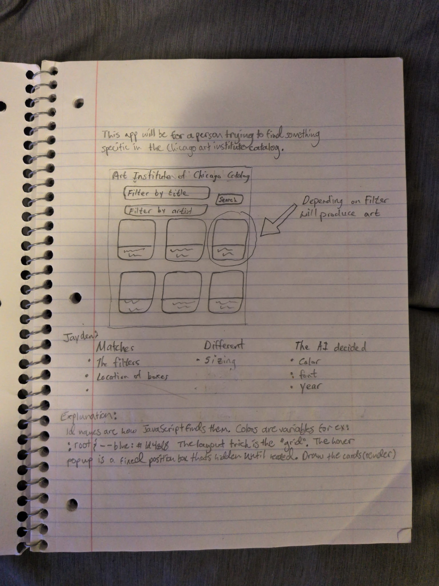
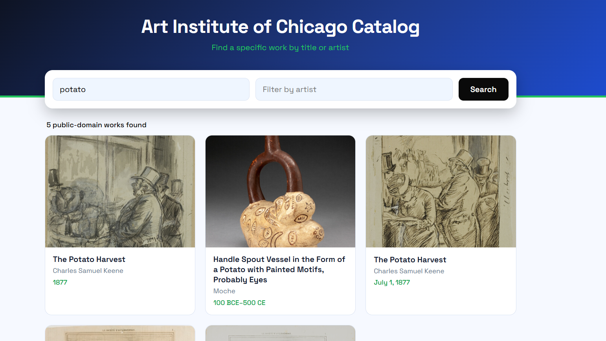

# Day 1 "before" snapshot

Write your own, even if you worked in a pair. Keep it: we come back to it at mid-quarter (Week 6) and at the end (Week 11). Your prompts go in `ai_log.md`, not here.

**Name: Reid Schmidt
**Partner: Jayden Low

## Before we prompted

### 1. Who is it for, and what do they want to do?

It's for someone who wants to find something specific in the Chicago Institute of Art catalog.

**"The user can..." sentences:**
1. The user can search/filter by painting title keywords and artist.
2. The user can click the painting to navigate towards the official Chicago Institute of Art website.
3. The user can view the paintings.

### 2. Our sketch

Put the photo in this `hw0` folder, then change the filename below to match:

### 3. Our prediction

We expected the app would let us find different paintings in the Chicago Institute of Art's catalog.

## What we got

It worked well! The website functioned how we hoped and looked nice. We tested it by using different key words and artists, and it brought up the correct paintings.

### 4. What the AI made

Put the screenshot in this `hw0` folder, then change the filename below to match:

### 5. Sketch vs. app

- **Matches our sketch: Layout, filters, location of search boxes and results
- **Different from our sketch: Sizing but nothing else major
- **The AI decided: Adding the dates of the paintings, the font, shape of each painting box, and amount of boxes per page

### 6. What did I keep, change, or reject, and why?

I added a cool function where when you hover over a painting it will show an enlarged preview. I thought this would enhance the user experience. I also chose the main website colors of blue, green, and black because I think those colors look good together. I also asked it to change the initial font because I wasn't a huge fan of the first font. Overall, Claude gave us a great website that did exactly what we asked, and with the improvements I asked it to implement, I think it would be helpful for people looking for certain artwork. 

### 7. Explain back

The part of the code I chose to focus on was the hover preview function. Here is a portion of the code: 

$("grid").addEventListener("mouseover", e=>{
  const box=e.target.closest(".img"); if(!box) return;
  pvImg.src = box.querySelector("img").src.replace("/full/400,/","/full/843,/");
  pv.style.display="block"; place(e);
});
$("grid").addEventListener("mousemove", e=>{ place(e) });
$("grid").addEventListener("mouseout", ...hide...); 

This section of the code allows the user to hover over a painting to see an enlarged preview. "place" puts the popup 20 px to the right of the user's curser. The "Listener" function attaches to the whole grid, not just one card, because when there are new searches the cards are replaced. The ".src.replace" part enlarges the original image as you can see it go from 400 to 843 px. And most importantly, the "mouseover" function allows the image to pop up when you hover on it. 

## Looking ahead

### 8. What does it do? Does it work? What broke?

To my suprise, the website and code worked! We tested a lot of different keywords and artist names and the images that popped up correlated correctly with the words. Even when I asked it to make changes, it adjusted well. 

### 9. How much do I understand about how it works? (0–100%)

**My number: 40%

**Why that number:**

I haven't learned Python before, but did learn some Java last year, so some of the code looked familiar. While reading the code over, I was generally able to understand what it was doing, but I definitely would not be able to make this code myself. 

### 10. What would I need to know to tell whether it's *well designed or well built*?

Well, first of all I think the function of the website itself would point to well built code, and since everything worked well, I would assume it's well designed. If we're talking about coding neatness and organization, I would need to learn more about Python to tell whether it is well designed. 

### 11. What do I hope to be able to do by week 10?

I hope to confidently be able to prompt ai to help me build websites and projects, and also to understand how Python works. I do a lot of music production and content, so it would be cool to see if anything I learn in this class can apply to that area of my life.
